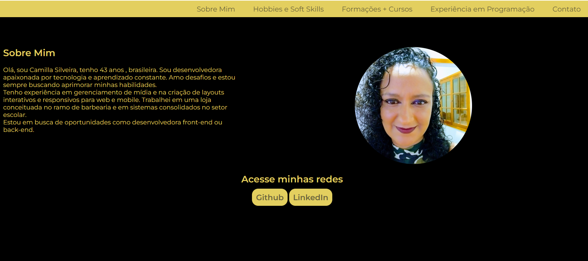
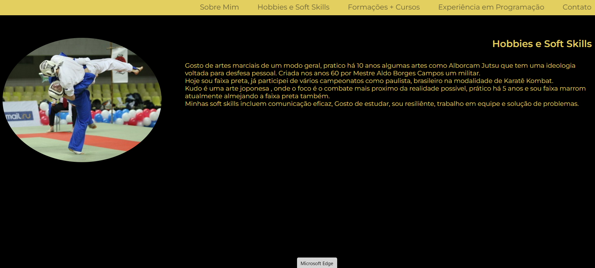
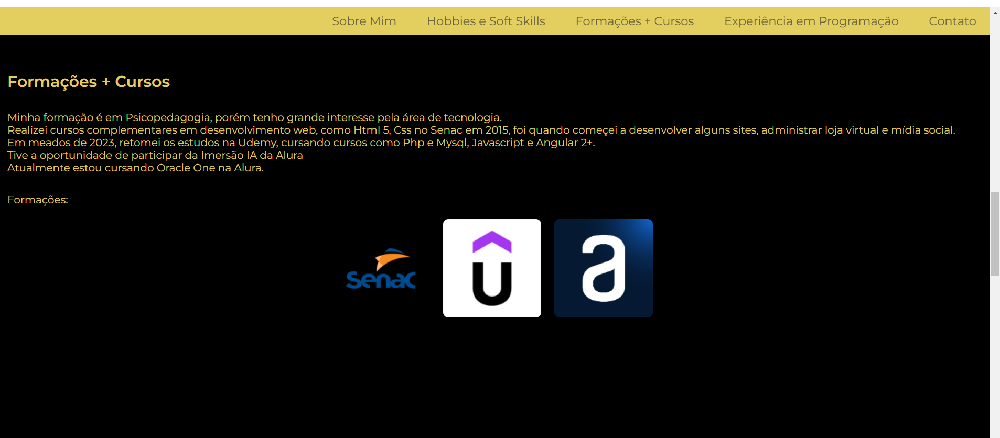
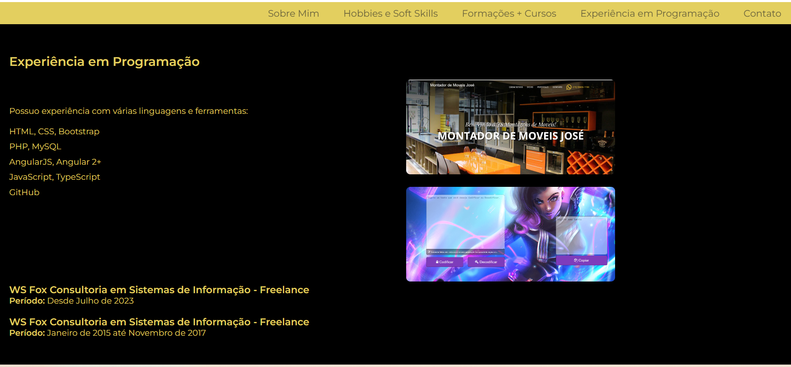
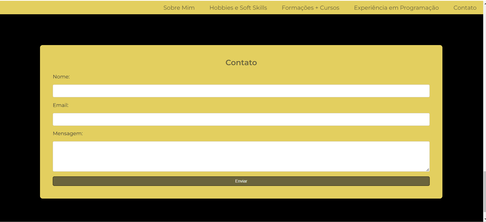
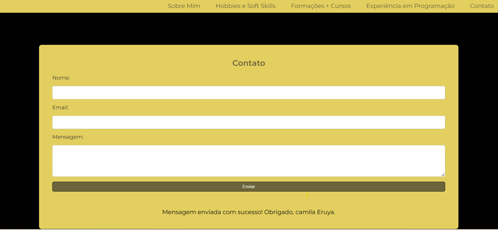
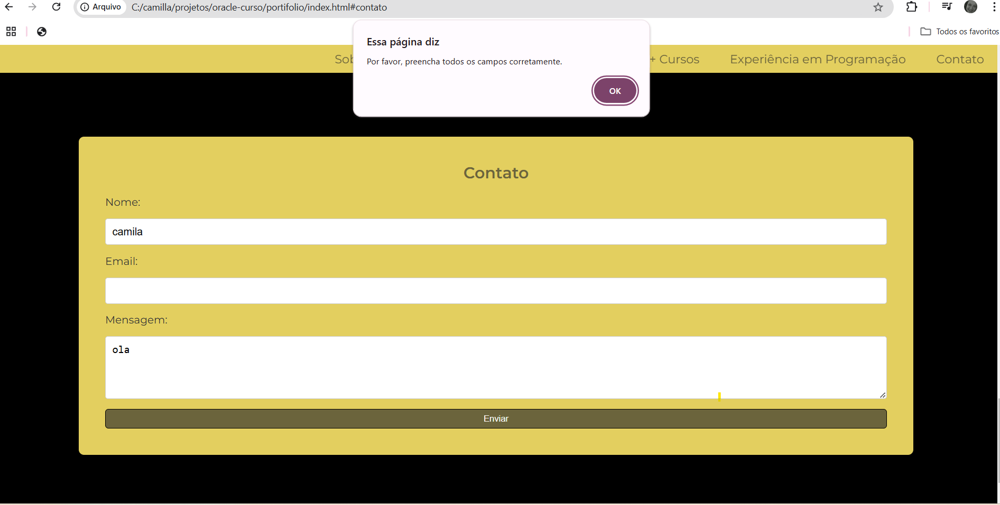
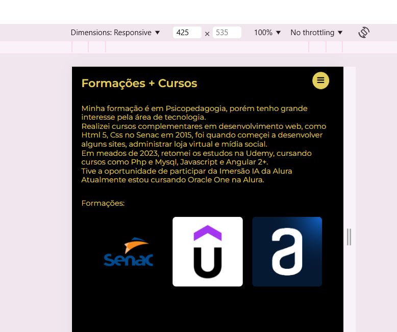
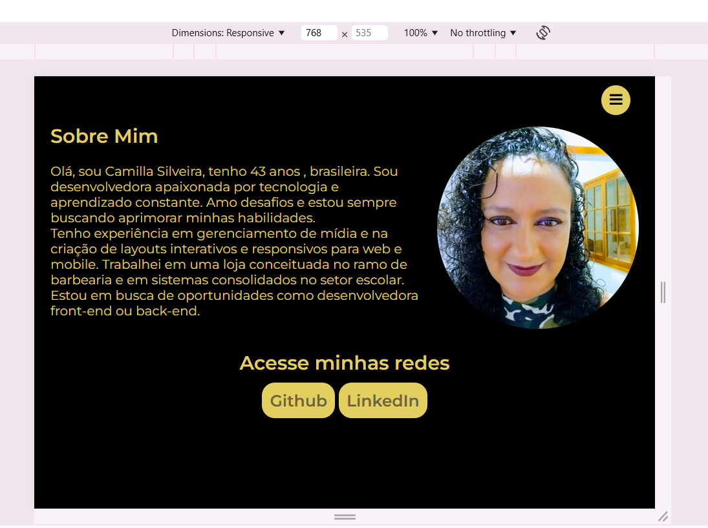
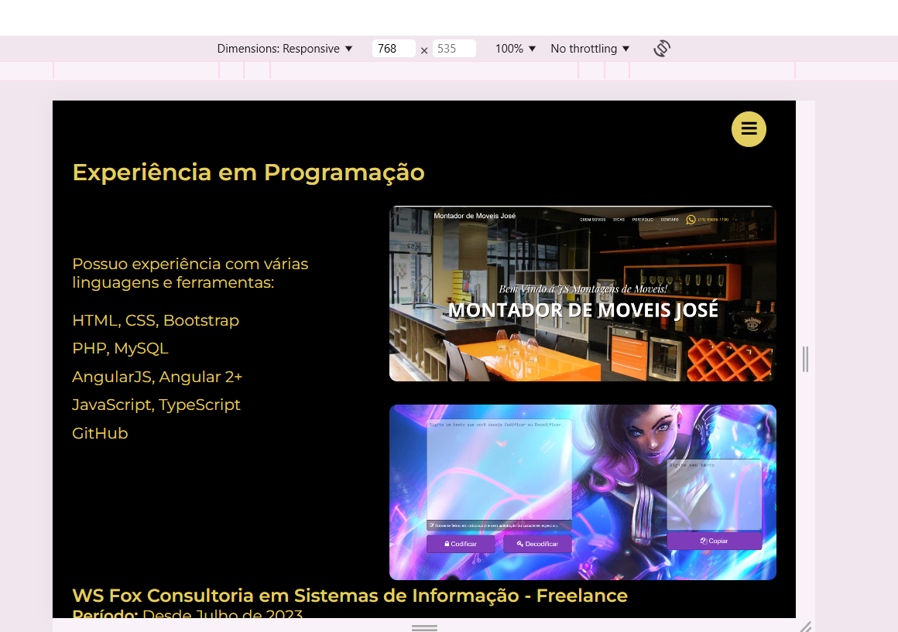

# Challenge desafio-portifolio

## Descrição

Este projeto é uma atividade do curso Oracle e Alura. Consiste em aplicar os conhecimentos aprendidos durante o curso para criar um portifolio com o conhecimento das aulas.

O desafio foi criar o portifolio somente com HTML, CSS e Javascript sem usar framework como Bootstrap que facilita bem e assim trás agilidade na produção, na responsividade de mobile deu um pouco de trabalho mas deu tuo certo. .

## Tecnologias Utilizadas

## Imagens Projeto

[https://github.com//CamillaEruya/portifolio/tree/master/img]

## Desenvolvido por

Camilla Silveira (Camila Eruya)
